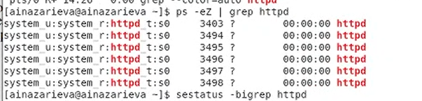

---
## Front matter
lang: ru-RU
title: Мандатное разграничение прав в Linux
author: Назарьева Алена НФИбд-03-18
institute:
	inst{1}RUDN University, Moscow, Russian Federation
date: 2021, 24 november
## Formatting
toc: false
slide_level: 2
theme: metropolis
mainfont: PT Serif
romanfont: PT Serif
sansfont: PT Sans
monofont: PT Mono
mainfontoptions: Ligatures=TeX
romanfontoptions: Ligatures=TeX
sansfontoptions: Ligatures=TeX,Scale=MatchLowercase
monofontoptions: Scale=MatchLowercase
header-includes:
 - \metroset{progressbar=frametitle,sectionpage=progressbar,numbering=fraction}
 - '\makeatletter'
 - '\beamer@ignorenonframefalse'
 - '\makeatother'
aspectratio: 43
section-titles: true
---
# Цель работы

Развить навыки администрирования ОС Linux. Получить первое практическое знакомство с технологией SELinux1.
Проверить работу SELinx на практике совместно с веб-сервером Apache.

# Выполнение лабораторной работы

## 1)
Вошла в систему с полученными учётными данными и убедилась, что SELinux работает в
режиме enforcing политики targeted с помощью команд getenforce и sestatus.
Обратилась с помощью браузера к веб-серверу, запущенному на моем компьютере, и убедилась,
что последний работает (рис. -@fig:001)

{ #fig:001 width=70% }

## 2)
Нашла веб-сервер Apache в списке процессов, определила его контекст безопасности. Как мы видим,
этот процесс запущен на домене httpd_t. Посмотрела текущее состояние переключателей SELinux для Apache
(рис. -@fig:002)

{ #fig:002 width=70% }

## 3)
Посмотрела статистику по политике с помощью команды seinfo, также
определила множество пользователей:8, ролей:14, типов:4793.
(рис. -@fig:003)

{ #fig:003 width=70% }

## 4)
Определила тип файлов и поддиректорий, находящихся в директории
httpd_sys_script_exec_t
httpd_sys_content_t
Определила тип файлов, находящихся в директории /var/www/html (рис. -@fig:004)

{ #fig:004 width=70% }

## 5)
Определила круг пользователей, которым разрешено создание файлов в
директории /var/www/html:rwxr-xr-x
Создала от имени суперпользователя (так как в дистрибутиве после установки только ему разрешена запись в директорию) html-файл /var/www/html/test.html. Проверила контекст созданного файла. Контекст,
присваиваемый по умолчанию вновь созданным файлам в директории
/var/www/html: unconfined_u:object_r:httpd_sys_content_t:s0
(рис. -@fig:005)

{ #fig:005 width=70% }
## 6)
Обратилась к файлу через веб-сервер, введя в браузере адрес
http://127.0.0.1/test.html. Убедилась, что файл был успешно отображён
(рис. -@fig:006)

{ #fig:006 width=70% }

## 7)
Изучила справку man httpd_selinux и выяснила, какие контексты файлов определены для httpd:httpd_sys_content_t;httpd_sys_script_exec_t;httpd_sys_script_ro_t;
httpd_sys_script_rw_t . Они совпадают с типом файла test.html. Проверила контекст файла можно командой
Изменила контекст файла /var/www/html/test.html с httpd_sys_content_t на любой другой,
к которому процесс httpd не должен иметь доступа, например, на samba_share_t:
После этого проверила, что контекст поменялся. (рис. -@fig:007)

{ #fig:007 width=70% }

## 8)
Попробовала ещё раз получить доступ к файлу через веб-сервер, введя в
браузере адрес http://127.0.0.1/test.html. Получила сообщение об ошибке (рис. -@fig:008)

{ #fig:008 width=70% }

## 9)
Проанализировала ситуацию. Доступ разрешен только между элементами с одинаковым типом, именно поэтому веб-сервер Apache может без проблем читать файл /var/www/html/test.html, который имеет тип httpd_sys_content_t. В то же самое время, так как Apache запущен на домене httpd_t и не имеет заполненных полей userid:username, он не может получить доступ к файлу home/username/test.html с другим типом, хотя этот файл доступен для чтения процессам, для которых не определена целевая политика. Просмотрела log-файлы веб-сервера Apache. Также просмотрела системный лог-файл:
В системе оказались запущенные процессы setroubleshootd и audtd, мы также смогли увидеть ошибки, аналогичные указанным
выше, в файле /var/log/audit/audit.log. (рис. -@fig:009)

{ #fig:009 width=70% }

## 10)
Попробовала запустить веб-сервер Apache на прослушивание ТСР-порта 81
(а не 80, как рекомендует IANA и прописано в /etc/services). Для этого в файле
/etc/httpd/httpd.conf нашла строчку Listen 80 и заменила её на Listen 81.
(рис. -@fig:010)

{ #fig:010 width=70% }

## 11)
Выполнила перезапуск веб-сервера Apache. Сбой не произошел (рис. -@fig:011)

{ #fig:011 width=70% }

## 12)
Проанализировала лог-файлы. Просмотрите файлы /var/log/http/error_log,
/var/log/http/access_log и /var/log/audit/audit.log и выяснила, что записи появились
только в /var/log/audit/audit.log (рис. -@fig:012)

{ #fig:012 width=70% }

## 13)
(рис. -@fig:013)

{ #fig:013 width=70% }

## 14)
Выполнила команду semanage port -a -t http_port_t -р tcp 81
После этого проверила список портов командой semanage port -l | grep http_port_t
Убедилась, что порт 81 появился в списке. Попробовала запустить веб-сервер Apache ещё раз.
Вернула контекст httpd_sys_cоntent__t к файлу /var/www/html/ test.html. (рис. -@fig:014)

{ #fig:014 width=70% }

## 15)
После этого попробовала получить доступ к файлу через веб-сервер, введя в браузере
адрес http://127.0.0.1:81/test.html. Увидела содержимое файла — слово «test». (рис. -@fig:015)

{ #fig:015 width=70% }

## 16)
Исправила обратно конфигурационный файл apache, вернув Listen 80. Попробовала удалить
привязку http_port_t к 81 порту. Порт 81 нельзя удалить, т.к. он определен на уровне политики
Удалила файл /var/www/html/test.html (рис. -@fig:016)

{ #fig:016 width=70% }

# Выводы

В результате выполнения работы я Развила навыки администрирования ОС Linux, Получида
первое практическое знакомство с технологией SELinux1, Проверила работу SELinx на практике
совместно с веб-сервером Apache.
