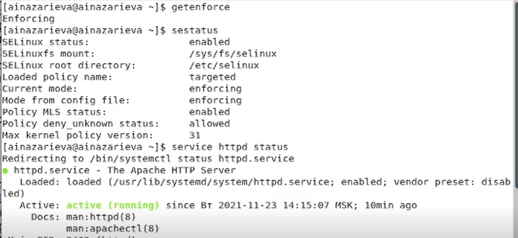
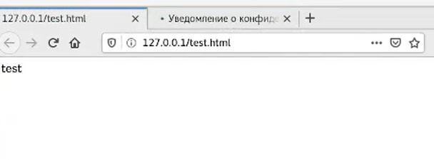
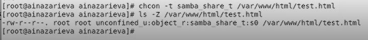
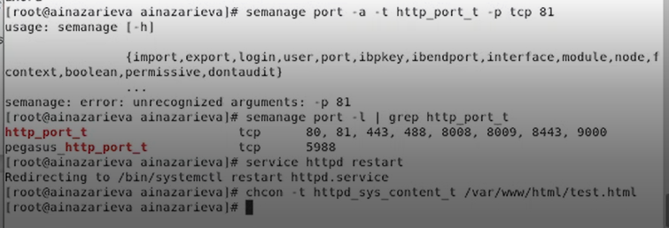
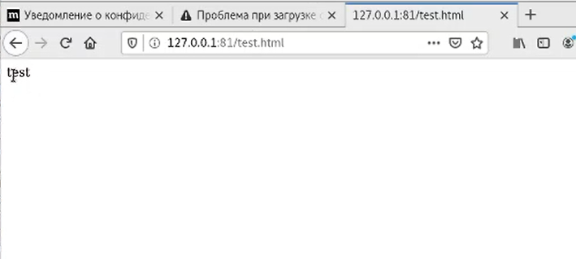

---
# Front matter
lang: ru-RU
title: "Oтчёт по лабораторной работе"
subtitle: "Мандатное разграничение прав в Linux"
author: "Назарьева Алена Игоревна НФИбд-03-18"

# Formatting
toc-title: "Содержание"
toc: true # Table of contents
toc_depth: 2
lof: true # List of figures
lot: true # List of tables
fontsize: 12pt
linestretch: 1.5
papersize: a4paper
documentclass: scrreprt
polyglossia-lang: russian
polyglossia-otherlangs: english
mainfont: PT Serif
romanfont: PT Serif
sansfont: PT Sans
monofont: PT Mono
mainfontoptions: Ligatures=TeX
romanfontoptions: Ligatures=TeX
sansfontoptions: Ligatures=TeX,Scale=MatchLowercase
monofontoptions: Scale=MatchLowercase
indent: true
pdf-engine: lualatex
header-includes:
  - \linepenalty=10 # the penalty added to the badness of each line within a paragraph (no associated penalty node) Increasing the value makes tex try to have fewer lines in the paragraph.
  - \interlinepenalty=0 # value of the penalty (node) added after each line of a paragraph.
  - \hyphenpenalty=50 # the penalty for line breaking at an automatically inserted hyphen
  - \exhyphenpenalty=50 # the penalty for line breaking at an explicit hyphen
  - \binoppenalty=700 # the penalty for breaking a line at a binary operator
  - \relpenalty=500 # the penalty for breaking a line at a relation
  - \clubpenalty=150 # extra penalty for breaking after first line of a paragraph
  - \widowpenalty=150 # extra penalty for breaking before last line of a paragraph
  - \displaywidowpenalty=50 # extra penalty for breaking before last line before a display math
  - \brokenpenalty=100 # extra penalty for page breaking after a hyphenated line
  - \predisplaypenalty=10000 # penalty for breaking before a display
  - \postdisplaypenalty=0 # penalty for breaking after a display
  - \floatingpenalty = 20000 # penalty for splitting an insertion (can only be split footnote in standard LaTeX)
  - \raggedbottom # or \flushbottom
  - \usepackage{float} # keep figures where there are in the text
  - \floatplacement{figure}{H} # keep figures where there are in the text
---

# Цель работы

Развить навыки администрирования ОС Linux. Получить первое практическое знакомство с технологией SELinux1.
Проверить работу SELinx на практике совместно с веб-сервером Apache.

# Выполнение лабораторной работы

1. Вошла в систему с полученными учётными данными и убедилась, что
SELinux работает в режиме enforcing политики targeted с помощью команд getenforce и sestatus.
2. Обратилась с помощью браузера к веб-серверу, запущенному на моем
компьютере, и убедилась, что последний работает:
service httpd status
или
/etc/rc.d/init.d/httpd status
(рис. -@fig:001)

{ #fig:001 width=70% }

3. Нашла веб-сервер Apache в списке процессов, определила его контекст
безопасности. Как мы видим, этот процесс запущен на домене httpd_t. Например, можно использовать команду
ps auxZ | grep httpd
или
ps -eZ | grep httpd
4. Посмотрела текущее состояние переключателей SELinux для Apache с
помощью команды
sestatus -bigrep httpd
(рис. -@fig:002)

{ #fig:002 width=70% }

5. Посмотрела статистику по политике с помощью команды seinfo, также
определила множество пользователей:8, ролей:14, типов:4793.
(рис. -@fig:003)

{ #fig:003 width=70% }

6. Определила тип файлов и поддиректорий, находящихся в директории
/var/www, с помощью команды:
ls -lZ /var/www:
httpd_sys_script_exec_t
httpd_sys_content_t
7. Определила тип файлов, находящихся в директории /var/www/html:
ls -lZ /var/www/html
(рис. -@fig:004)

{ #fig:004 width=70% }

8. Определила круг пользователей, которым разрешено создание файлов в
директории /var/www/html.
rwxr-xr-x
9. Создала от имени суперпользователя (так как в дистрибутиве после установки только ему разрешена запись в директорию) html-файл
/var/www/html/test.html следующего содержания:
<html>
<body>test</body>
</html>
10. Проверила контекст созданного файла. Контекст,
присваиваемый по умолчанию вновь созданным файлам в директории
/var/www/html: unconfined_u:object_r:httpd_sys_content_t:s0
(рис. -@fig:005)

{ #fig:005 width=70% }
11. Обратилась к файлу через веб-сервер, введя в браузере адрес
http://127.0.0.1/test.html. Убедилась, что файл был успешно отображён
(рис. -@fig:006)

{ #fig:006 width=70% }

12. Изучила справку man httpd_selinux и выяснила, какие контексты файлов определены для httpd:httpd_sys_content_t;httpd_sys_script_exec_t;httpd_sys_script_ro_t;
httpd_sys_script_rw_t . Они совпадают с типом файла
test.html. Проверила контекст файла можно командой ls -Z.
ls -Z /var/www/html/test.html

13. Изменила контекст файла /var/www/html/test.html с
httpd_sys_content_t на любой другой, к которому процесс httpd не
должен иметь доступа, например, на samba_share_t:
chcon -t samba_share_t /var/www/html/test.html
ls -Z /var/www/html/test.html
После этого проверила, что контекст поменялся.
(рис. -@fig:007)

{ #fig:007 width=70% }

14. Попробовала ещё раз получить доступ к файлу через веб-сервер, введя в
браузере адрес http://127.0.0.1/test.html. Получила
сообщение об ошибке:
Forbidden
You don't have permission to access /test.html on this server.
(рис. -@fig:008)

{ #fig:008 width=70% }

15. Проанализировала ситуацию. Доступ разрешен только между элементами с одинаковым типом, именно поэтому веб-сервер Apache может без проблем читать файл /var/www/html/test.html, который имеет тип httpd_sys_content_t. В то же самое время, так как Apache запущен на домене httpd_t и не имеет заполненных полей userid:username, он не может получить доступ к файлу home/username/test.html с другим типом, хотя этот файл доступен для чтения процессам, для которых не определена целевая политика
ls -l /var/www/html/test.html
Просмотрела log-файлы веб-сервера Apache. Также просмотрите системный лог-файл:
tail /var/log/messages
В системе оказались запущенные процессы setroubleshootd и
audtd, мы также смогли увидеть ошибки, аналогичные указанным
выше, в файле /var/log/audit/audit.log.
(рис. -@fig:009)

{ #fig:009 width=70% }

16. Попробовала запустить веб-сервер Apache на прослушивание ТСР-порта
81 (а не 80, как рекомендует IANA и прописано в /etc/services). Для
этого в файле /etc/httpd/httpd.conf нашла строчку Listen 80 и
заменила её на Listen 81.
(рис. -@fig:010)

{ #fig:010 width=70% }

17. Выполнила перезапуск веб-сервера Apache. Сбой не произошел
(рис. -@fig:011)

{ #fig:011 width=70% }

18. Проанализировала лог-файлы:
tail -nl /var/log/messages
Просмотрите файлы /var/log/http/error_log,
/var/log/http/access_log и /var/log/audit/audit.log и
выяснила, что записи появились только в /var/log/audit/audit.log
(рис. -@fig:012)

{ #fig:012 width=70% }

(рис. -@fig:013)

{ #fig:013 width=70% }

19. Выполнила команду
semanage port -a -t http_port_t -р tcp 81
После этого проверила список портов командой
semanage port -l | grep http_port_t
Убедилась, что порт 81 появился в списке.

20. Попробовала запустить веб-сервер Apache ещё раз.
21. Вернула контекст httpd_sys_cоntent__t к файлу /var/www/html/ test.html:
chcon -t httpd_sys_content_t /var/www/html/test.html
(рис. -@fig:014)

{ #fig:014 width=70% }

После этого попробовала получить доступ к файлу через веб-сервер, введя в браузере адрес http://127.0.0.1:81/test.html.
Увидела содержимое файла — слово «test».
(рис. -@fig:015)

{ #fig:015 width=70% }

22. Исправила обратно конфигурационный файл apache, вернув Listen 80.
23. Попробовала удалить привязку http_port_t к 81 порту:
semanage port -d -t http_port_t -p tcp 81
порт 81 нельзя удалить, т.к. он определен на уровне политики
24. Удалила файл /var/www/html/test.html:
rm /var/www/html/test.html
(рис. -@fig:016)

{ #fig:016 width=70% }

# Выводы

В результате выполнения работы я Развила навыки администрирования ОС Linux, Получида первое практическое знакомство с технологией SELinux1, Проверила работу SELinx на практике совместно с веб-сервером Apache.
